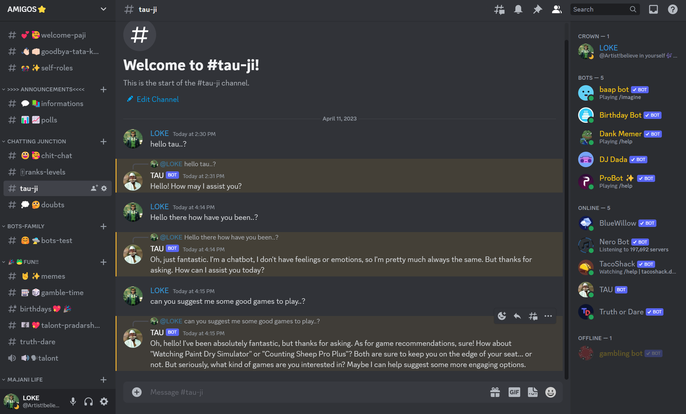

# Discord_gpt_bot

# GPT 3.5 Turbo Chat Bot

This is a simple Discord chat bot built using discord.js and the gpt-3.5-turbo model from Open AI. This is the same model used for the popular chatbot Chat GPT.





Credits: 

a. A full video tutorial for this chat bot can be found [here](https://youtu.be/CB76_GDrPsE)

b. For hosting it publicaly for eternity [here](https://www.youtube.com/watch?v=Gqurhm2QxA0&t=433s)

## How to setup

1. Clone the repository to the current directory

```powershell
git clone https://github.com/star-56/Discord_gpt_bot.git
```

2. Install all the dependencies

- Using npm
```powershell
npm install
```

- Using yarn
```powershell
yarn
```

3. Create a new file called `.env` and copy the format from `.env.example` (or you can just rename `.env.example`)

4. Update `.env` with your own credentials.

5. Start your bot

- Using npm
```powershell
npm run start
```

- Using yarn
```powershell
yarn start
```
